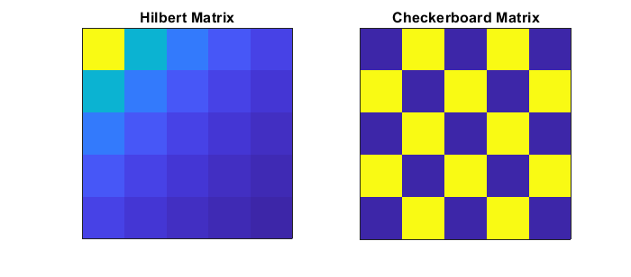

## Hilbert Matrix (1) & CheckerBoard Matrix (2) : 
$$
M_{i,j} = \frac{1}{i + j - 1} (1) 
\\ \\
M_{i , j} = -1^{i+j-1} (2)
$$
```matlab
m = 5;
Hil_Mat = zeros(m); % Hilbert matrix
Check_Mat = zeros(m); %checker Board matrix

for i=1:m
    for j=1:m
        den = i + j - 1; %denominatuer
        Hil_Mat(i,j) = 1 / den;
        Check_Mat(i,j) = (-1).^(den);
    end
end
```


## Upper Triangular Matrix

```matlab
m = 50;
UT_Mat = zeros(m); % Hilbert matrix

for i=1:m
    for j=1:m
        if i<j
            UT_Mat(i,j) = 1;
        end
    end
end

figure(1), clf

subplot(121)
imagesc(UT_Mat)
axis square, title('Upper Triangular Matrix')
set(gca,'xtick',[],'ytick',[])
```

## XX